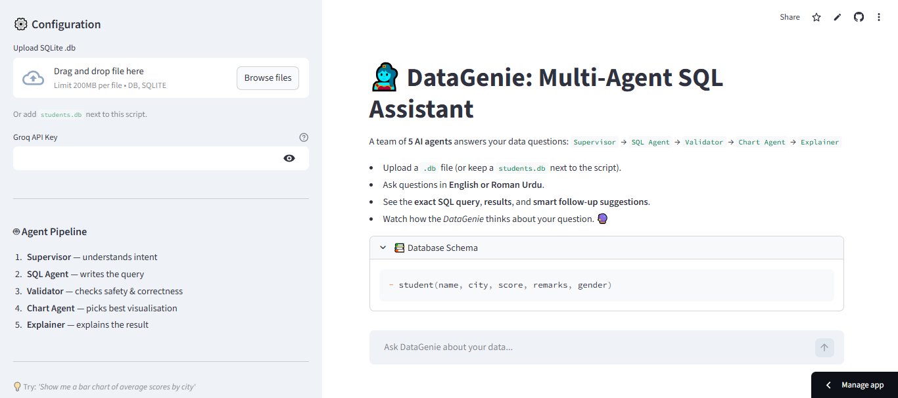
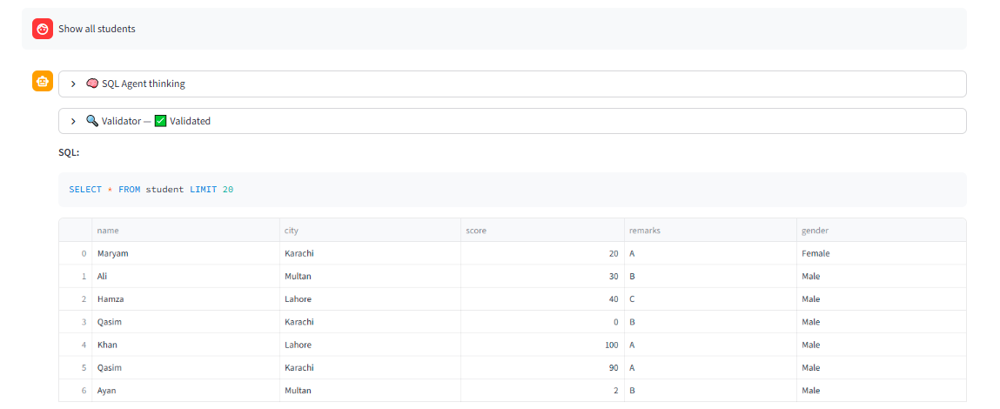
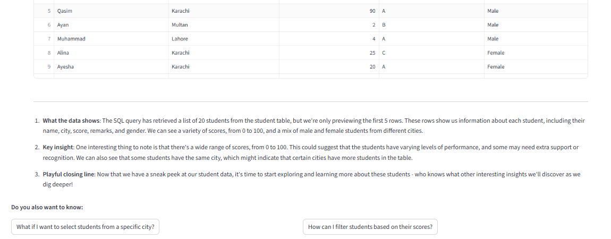
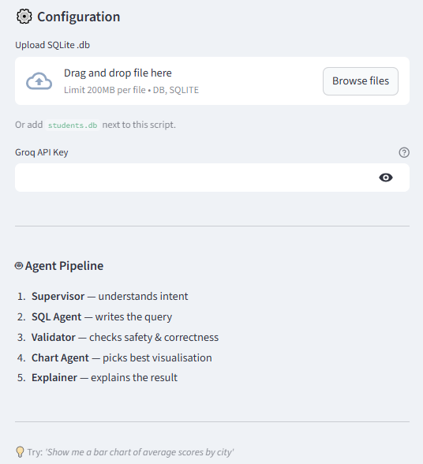

# 🧞‍♀️ DataGenie — Multi-Agent SQL Assistant

> **Talk to your SQLite database in plain English — powered by 5 AI agents for SQL generation, validation, auto-charts, and explanations using LangChain, Groq LLaMA3, and Streamlit.**


---

## 🚀 Live Demo
🔗 [View Live App](https://datagenie-sql-agent.streamlit.app/)

---

## 📸 Screenshots





---

## 🧠 Overview
DataGenie is a **multi-agent SQL assistant** that converts natural language questions into SQL queries, validates them, executes them, visualizes results, and explains findings — all powered by a pipeline of **5 specialized AI agents** using Groq's LLaMA-3.3-70b model.

Ask questions in **English or Roman Urdu** and get back the exact SQL, results, charts, and a plain-English explanation.

---

## 🤖 5-Agent Pipeline

```
User Question
      ↓
🧠 Supervisor Agent    — understands intent, refines question
      ↓
✍️  SQL Agent          — writes optimized SQLite SELECT query
      ↓
🔍 Validator Agent     — checks safety, correctness, and logic
      ↓
📊 Chart Agent         — picks best visualization for the data
      ↓
💬 Explainer Agent     — explains results in simple language
      ↓
Answer + Chart + Follow-up Suggestions
```

---

## ✨ Features
- Ask questions in **English or Roman Urdu**
- **5 specialized agents** — each with a distinct role
- **Validator Agent** blocks unsafe queries (no INSERT/UPDATE/DELETE)
- **Auto chart generation** — bar, line, scatter, pie, histogram via Plotly
- **Smart follow-up suggestions** after every answer
- Upload any **SQLite .db file** or use default `students.db`
- Full **chat history** with preserved dataframes and charts
- Debug panels showing agent thinking at each step

---

## 🧰 Tech Stack
| Tool | Purpose |
|---|---|
| LangChain | Multi-agent orchestration |
| Groq (LLaMA-3.3-70b) | LLM for all 5 agents |
| SQLite + Pandas | Database execution + data handling |
| Plotly | Auto-generated charts |
| Streamlit | Chat interface + deployment |

---

## 📁 Project Structure
```
datagenie-sql-agent/
├── DataAnalystBot.py   # Full 5-agent pipeline + Streamlit UI
├── students.db         # Default sample database
├── requirements.txt
└── README.md
```

---

## ⚙️ Run Locally
```bash
git clone https://github.com/maryamasifaziz/datagenie-sql-agent
cd datagenie-sql-agent
pip install -r requirements.txt
streamlit run DataAnalystBot.py
```

Add your Groq API key in `.env`:
```
GROQ_API_KEY=your_groq_api_key
```
Or enter it directly in the app sidebar.

---

## 🔑 Get Your Free Groq API Key
1. Go to **console.groq.com**
2. Sign up free
3. Create an API key
4. Paste it in the sidebar or `.env`

---

## 💡 Example Questions
- *"Show me average scores by city"*
- *"Which students scored above 80?"*
- *"Bar chart of students per major"*
- *"Kaun se students Karachi mein hain?"* (Roman Urdu)

---

## 🛡️ Safety
The Validator Agent blocks all non-SELECT queries. No INSERT, UPDATE, DELETE, DROP, or PRAGMA statements can be executed — your database is always safe.

---

## 👤 Author
**Maryam Asif**  
🎓 FAST NUCES  
🔗 [LinkedIn](https://linkedin.com/maryamasifaziz) | [GitHub](https://github.com/maryamasifaziz)
